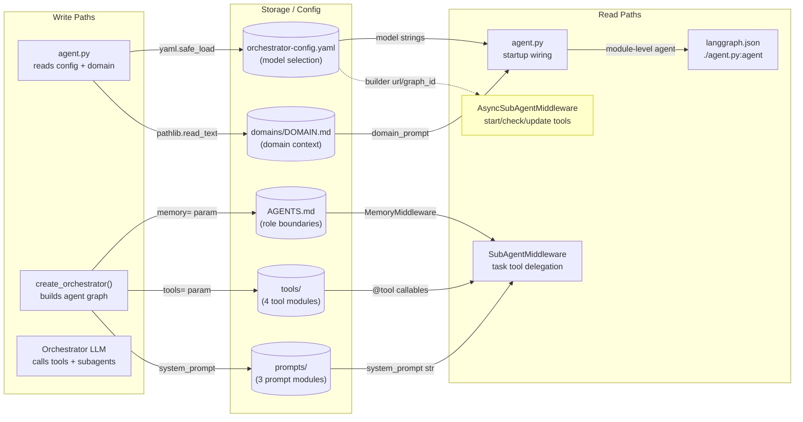
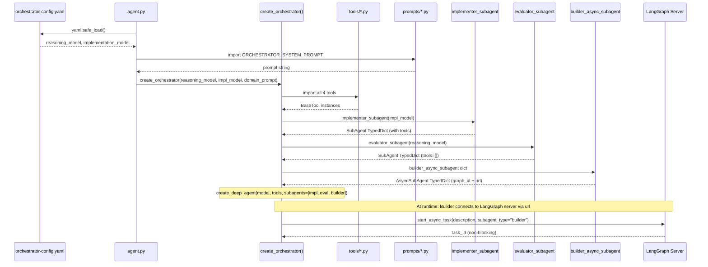
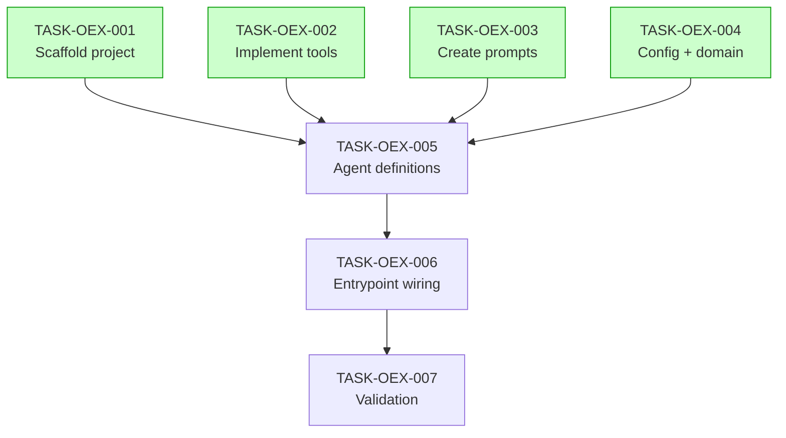

# Implementation Guide: DeepAgents Orchestrator Exemplar

## Overview

Build a three-role agent exemplar (Orchestrator + Implementer + Evaluator) with multi-model architecture and non-blocking AsyncSubAgent execution using the DeepAgents SDK 0.5.0a2.

**Source spec**: [FEAT-orchestrator-exemplar-build.md](../../../docs/research/project_template/FEAT-orchestrator-exemplar-build.md)
**Review task**: TASK-REV-8562
**Feature ID**: FEAT-OEX

---

## Data Flow: Read/Write Paths

**Note**: The AsyncSubAgent (Builder) path is marked yellow because it requires a running LangGraph server endpoint. For the exemplar, use `langgraph dev` locally or document as a deployment prerequisite.

---

## Integration Contracts

---

## Task Dependencies

_Tasks with green background can run in parallel (Wave 1)._

---

## Execution Strategy

### Wave 1: Foundation (4 tasks, parallel)

| Task | Title | Complexity | Mode | Workspace |
|------|-------|-----------|------|-----------|
| TASK-OEX-001 | Scaffold project | 3/10 | direct | oex-wave1-1 |
| TASK-OEX-002 | Implement tools | 5/10 | task-work | oex-wave1-2 |
| TASK-OEX-003 | Create prompts | 4/10 | direct | oex-wave1-3 |
| TASK-OEX-004 | Config + domain | 3/10 | direct | oex-wave1-4 |

All four tasks are independent — no shared files, no data dependencies. Safe to run in parallel.

### Wave 2: Agents (2 tasks, sequential)

| Task | Title | Complexity | Mode | Dependencies |
|------|-------|-----------|------|--------------|
| TASK-OEX-005 | Agent definitions | 7/10 | task-work | All Wave 1 tasks |
| TASK-OEX-006 | Entrypoint wiring | 5/10 | task-work | TASK-OEX-005 |

TASK-OEX-005 depends on all Wave 1 outputs (tools, prompts, config). TASK-OEX-006 depends on TASK-OEX-005 (needs agent factories).

### Wave 3: Validation (1 task)

| Task | Title | Complexity | Mode | Dependencies |
|------|-------|-----------|------|--------------|
| TASK-OEX-007 | Validation | 4/10 | task-work | TASK-OEX-006 |

Runs the smoke test from spec Section 6 and verifies file tree completeness.

---

## SDK Corrections Applied

These corrections were identified during the review deep dive and are reflected in the task acceptance criteria:

1. **Evaluator `tools: []`** — SDK requires explicit `tools` field in new API. Evaluator must have `"tools": []`, not omit the field.
2. **Builder `graph_id`** — AsyncSubAgent TypedDict requires `graph_id` field (the graph name on the remote server).
3. **Module-level `agent`** — `agent.py` must export `agent = create_deep_agent(...)` at module level for `langgraph.json` compatibility.
4. **`provider:model` format** — Config values must use `"anthropic:claude-sonnet-4-6"` format for `init_chat_model()`.
5. **SubAgent `model` required** — Each SubAgent must include explicit `model` field (no inheritance in new API).

---

## §4: Integration Contracts

### Contract: TOOLS
- **Producer task:** TASK-OEX-002
- **Consumer task(s):** TASK-OEX-005
- **Artifact type:** Python module exports
- **Format constraint:** All four tools must be `@tool`-decorated callables importable from `tools/` package, each returning `str`
- **Validation method:** Import all tools and verify they are `BaseTool` instances

### Contract: PROMPTS
- **Producer task:** TASK-OEX-003
- **Consumer task(s):** TASK-OEX-005
- **Artifact type:** Python string constants
- **Format constraint:** `ORCHESTRATOR_SYSTEM_PROMPT`, `IMPLEMENTER_SYSTEM_PROMPT`, `EVALUATOR_SYSTEM_PROMPT` must be non-empty strings importable from `prompts/` package
- **Validation method:** Import all prompts and verify they are `str` with length > 50

### Contract: CONFIG
- **Producer task:** TASK-OEX-004
- **Consumer task(s):** TASK-OEX-005, TASK-OEX-006
- **Artifact type:** YAML configuration file
- **Format constraint:** `orchestrator-config.yaml` must have `orchestrator.reasoning_model` and `orchestrator.implementation_model` keys with `"provider:model"` format strings compatible with `init_chat_model()`
- **Validation method:** Load YAML and verify both model keys contain `:` separator

### Contract: AGENT_FACTORIES
- **Producer task:** TASK-OEX-005
- **Consumer task(s):** TASK-OEX-006
- **Artifact type:** Python factory functions
- **Format constraint:** `create_orchestrator(reasoning_model, implementation_model, domain_prompt)` must return `CompiledStateGraph`
- **Validation method:** Inspect function signature for required parameters

---

## Key Architecture Decisions

| Decision | Choice | Rationale |
|----------|--------|-----------|
| D1 | nvidia_deep_agent as backbone | Multi-model, subagent delegation, context_schema proven |
| D5 | Different models per role | Block paper: self-evaluation fails with single model |
| D6 | Three roles (O+I+E) | Orchestrator reasons, Implementer executes, Evaluator reviews |
| D7 | Tools as external wrappers | Exemplar uses stubs; production wraps GuardKit commands |
| D9 | uv + deepagents>=0.5.0a2 | SDK 0.5 required for AsyncSubAgent |

## Next Steps

1. Review task files in [tasks/backlog/orchestrator-exemplar/](.)
2. Start with Wave 1 tasks (4 parallel)
3. Use `/task-work TASK-OEX-001` to begin implementation
